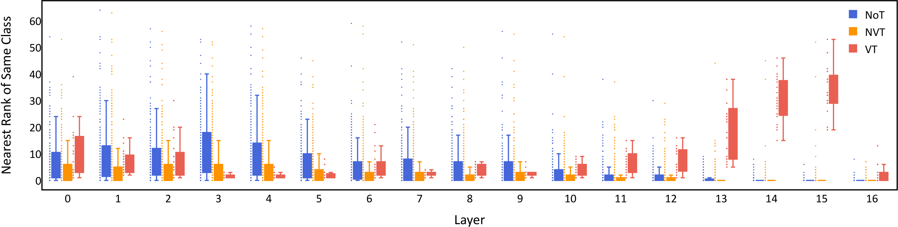

# Robust Backdoor Detection for Deep Learning via Topological Evolution Dynamics

This is the official repository for the paper "[Robust Backdoor Detection for Deep Learning via Topological Evolution Dynamics](https://arxiv.org/abs/2312.02673)" presented at IEEE Symposium on Security and Privacy (S&P) 2024.




## Source-Specific and Dynamic-Triggers (SSDT) Attack

To execute the Source-Specific and Dynamic-Triggers (SSDT) attack on the CIFAR-10, MNIST, or GTSRB dataset, use the following configuration:

- **Command**: `python train_SSDT.py`
- **Arguments**:
  - `--dataset [cifar10/mnist/gtsrb]` (replace with the desired dataset)
  - `--attack_mode SSDT`
  - `--n_iters 300`

Example command for CIFAR-10:

```bash
python train_SSDT.py --dataset cifar10 --attack_mode SSDT --n_iters 300
```

## Topological Evolution Dynamics (TED) Defense

To explore the TED defense methodology, use the `TED.ipynb` Jupyter Notebook provided in this repository. 
